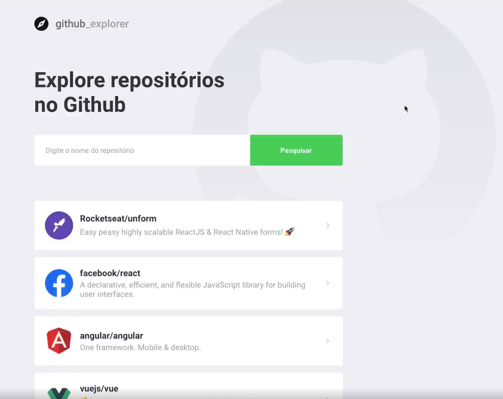
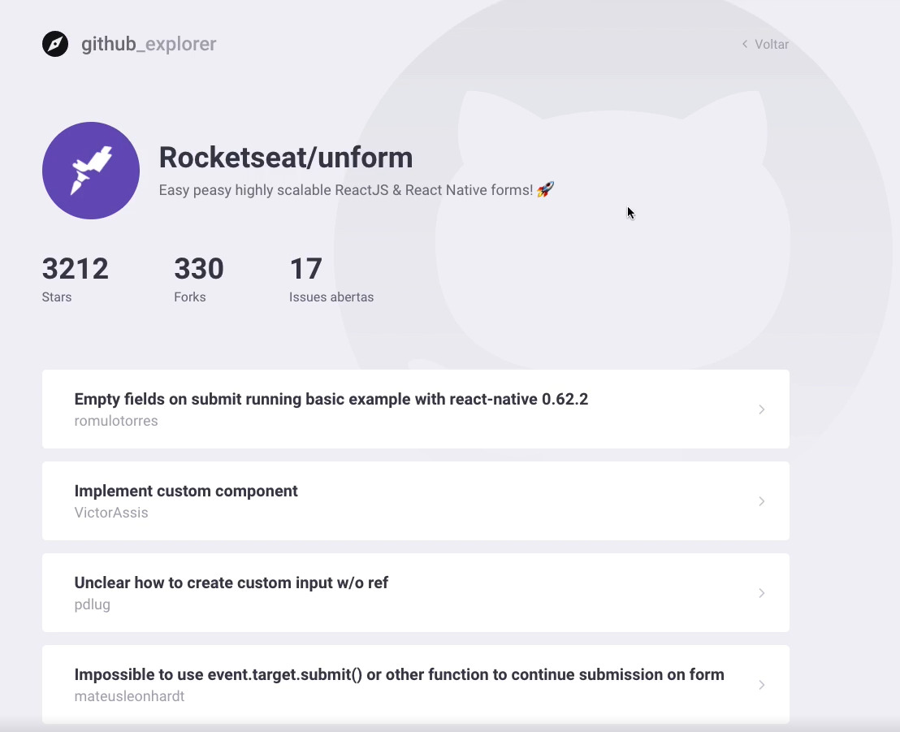

<p align="center">
    
</p>

# Explore os repositórios do GitHub!
>Projeto realizado durante o Bootcamp GoStack, ministrado pela Rocketseat.

Feito utilizando ReactJS e a API pública do GitHub, o github_explorer é uma aplicação simples para se explorar os repositórios dos usuários do próprio GitHub e visualizar suas estrelas, forks e issues abertas.

## Tecnologias envolvidas
- [React](https://pt-br.reactjs.org)
- [Styled Components](https://styled-components.com/)
- [Axios](https://www.npmjs.com/package/axios)

## Getting started
Para rodar o projeto, é necessária a instalação de suas dependências aplicando o seguinte comando na raíz do projeto:
```
yarn
```
E depois rodar o projeto React com o comando:
```
yarn start
```

## Screenshots
>Páginas de home e do repositório, respectivamente
<p>
    
    
</p>
